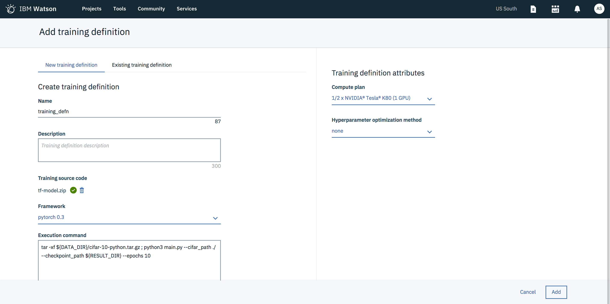

# Creating a training definition

A training definition is your manifest providing various details about the training you'd be running. On the right panel, click on the `Add training definition` link and create a `New training definition`.

1.Provide details about the experiment name and description.

2.Upload your training model code by dropping off the zip file found [here](model/) in the section marked to upload the model file. In our case we will be using the code from [here](model/), which is a sample program written in python using PyTorch to train a model on the CIFAR-10 dataset using various models. In this example, we will be using VGG-16

3.Select the framework as pytorch 0.3 from the dropdown.

4.Copy the execution command as

```python
python3 main.py --cifar_path ${DATA_DIR} --checkpoint_path ${RESULT_DIR} --epochs 10
```

The execution command is your entry point, which is used to trigger your program.

5.On the `Training definition attributes` section on the right panel, select `Compute plan` as `1/2 x NVIDIA® Tesla® K80 (1 GPU)` . This specifies the GPUs that you will be able to use for your training. Running on more powerful hardware is as easy as selecting a different compute configuration.

6.We will not be doing `Hyperparameter optimization method` as a part of this lab, so select the option as `none`.

7.Click on create button, this will create the training definition and will bring you back to the create experiment page. 



8.Click on `create and run` button and this should start the training.


9.Hurray!! You have a training running. Follow the direction [here](step_four.md) to see the progress of the training.
